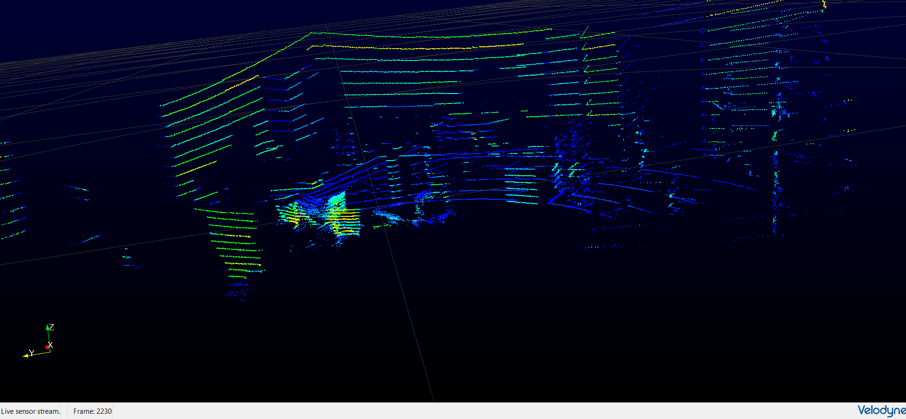
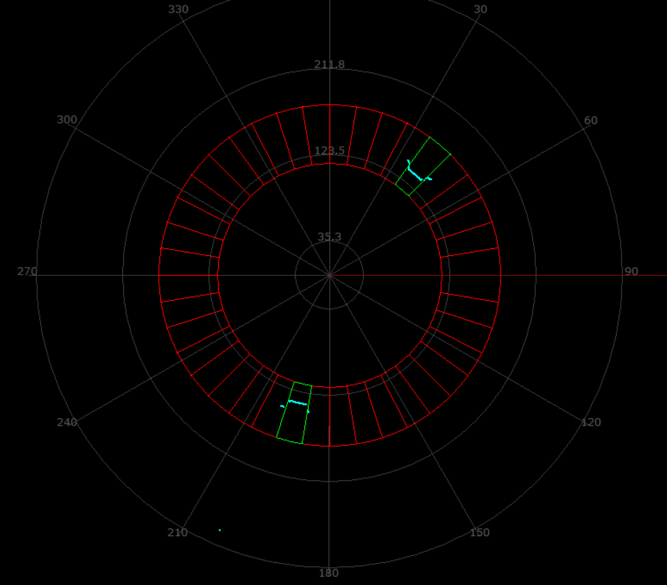
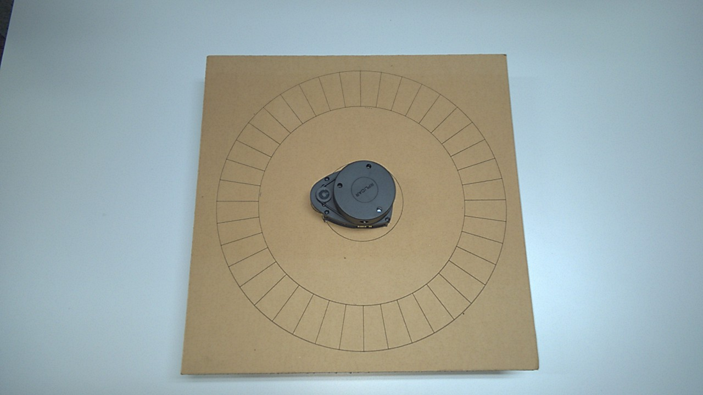
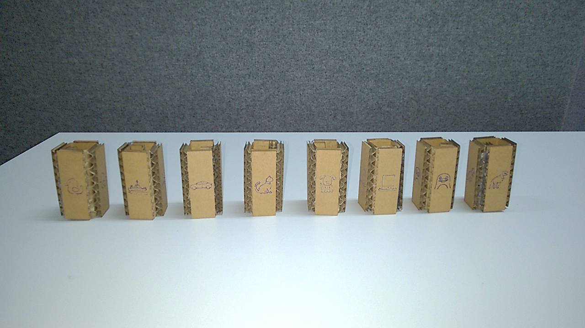

# TTISD Project

2019-05-29 ~ Bjorn Jorissen, William Thenaers

------

## Target scope
Our initial idea was to embed a board game with complex rules within a technological framework to decrease the knowledge needed to play the game. This framework could be used to play any similar board game, i.e. a game where a player's pawn moves over squares.

This framework would combine RFID tags to identify the used pawns and their positions and an addtional LIDAR to determine where it moved to. This idea evolved during our research and experiments, as we encountered some problems with our initial scope.

As an example, we provided a Monopoly game with a simplified rule set. The game itself is digital, but the board, pawns and dice are physical. The framework mentioned above would be used to determine the positions of each pawn and to detect and report if they moved.

## Initial ideas

### Multiple scanners

Our first idea was to work with multiple scanners arranged in a grid and RFID tags on every pawn on the board game. By using this approach, it would be possible to determine the exact position of a tag by measuring the time it took to read it from multiple locations [[ref](Research\RFID\Documentation\hinske-pg07-rfidtabletop.pdf)]. This idea is not very cost-effective, as each position in the grid would need a separate antenna, RFID tag reader and MCU to control it.

Seeing as this would not be viable and because we where told there was a simultaneous RFID reader available that could read 100s of tags per second, we opted to try that instead, hence the second idea below.

### Multiple tags with one scanner
Because the first idea was viable, we tried to use the [*SparkFun Simultaneous RFID Tag Reader*](https://www.sparkfun.com/products/14066) instead. The board would now consist of a grid with an RFID tag at each position. Pawns would have some metallic or signal blocking material on their bottom, blocking out the tag underneath. This way, tags that can not be read, are tags containing a player's pawn. We tested how well this idea worked.

We started with the example code from the [Arduino library](https://github.com/sparkfun/SparkFun_Simultaneous_RFID_Tag_Reader_Library) [[local](Research\RFID\Arduino test sketches\SparkFun_Simultaneous_RFID_Tag_Reader_Library-master.7z), requires [ArduinoSTL lib](https://github.com/mike-matera/ArduinoSTL)]. The reader works to some extent when just reading tags that pass by the antenna (see [`Research\RFID\Arduino test sketches`](Research\RFID\Arduino test sketches\)), but we never got a reliable readout. Example applications from other users show that the setup should be capable of detecting multiple tags that pass in front of the antenna, and fair enough if tags pass by, they get detected. But multiple UHF RFID tags resulted in a continuous bad CRC error when they are just held stationary in front of the antenna. Since our proposed application would require the detection of a grid of stationary tags, this method proved to fail our expectations.

A possible cause could be that these Ultra-High Frequency tags (UHF) are subject to interference with other tags or other UHF signal sources, although they are designed in a way the mitigates this problem. Another adjustment we tried, was providing the reader with an external power supply and increasing the signal strength. This however, yielded no better results than just using the usb powered Arduino. Experiments in the way the code handled reading tags were also in vain.

Most other applications are using this setup to detect items passing in front of the antenna and only needing to detect each unique tag once. When doing the same thing, we noticed that the tags were indeed read correctly. We concluded that the energy needed for a signal to read a tag is best transmitted and received if the tag is moving. As mentioned before, using this approach would result in a completely different game design, so we opted against it. 

### LIDAR
While working on the RFID tags we also experimented with a LIDAR sensor.

The [Velodyne LIDAR](https://velodynelidar.com/vlp-16.html) that was available, has a minimum range of 1 meter and a maximum range of 100 meters. While this is good for outdoor applications, like tracking large environments which is what the LIDAR is designed for, it is overkill for the application we wanted to create. Apart from the high range, it can measure multiple vertical levels to create a 3D environment map. Example traces can be found in [`Research\LIDAR\Velodyne LIDAR`](Research\LIDAR\Velodyne LIDAR) ([VeloView](https://velodynelidar.com/downloads.html#software) software required to read them).

We were shown a [paper](Research\LIDAR\SurfaceSight A New Spin on Touch and Object Sensing for IoT Experiences.pdf) that used a LIDAR sensor to identify objects and gestures, but as we wanted to use small pawns, this did not look applicable to our idea. It still consisted of combining a LIDAR with RFID tag tracking to create a board game. 

The Velodyne LIDAR was far too expensive for use in a simple prototype game.

After some research, we found a valid alternative for our application: the [Slamtec RPLIDAR A1](https://www.slamtec.com/en/Lidar/A1) development kit. This sensor is commonly used for small autonomous robots and has a smaller range, from 20 cm to 10 m, and can only see in one plane. Using the accompanied SDK in [`Research\LIDAR\RPLIDAR\rplidar_sdk_v1.10.0`](Research\LIDAR\RPLIDAR\rplidar_sdk_v1.10.0\), creating an integrated program proved easy. We modified the example `frame_grabber` program to include a segment matching algorithm. This can be found in [`Code\Deploy\frame_grabber.exe`](Code\Deploy\frame_grabber.exe).

After providing some settings like the amount of segments and the start and end distance to look in, the segmented circle as shown above can be drawn. We created some function so we could query which segments are `detected`, i.e. contain a pawn.

## Monopoly

Because the method of using the RFID tag scanning proved not reliable enough for our needs, we decided to drop it and continue on working with the RPLIDAR. The resolution of the RPLIDAR is not high enough to accurately distinguish between individual pawn, so we decided on simplifying the game's design. The physical board would be a segmented circle like the `frame_grabber` example shown above, and the players would throw their dice and move their pawn on the board. After each turn, the LIDAR can detect the changes in detected segments and extrapolate how many spaces a pawn moved.

The game has to stay turn based to be able to track the current player's pawn, since no unique pawns can be seen by the LIDAR. The physical board should contain the segments as shown below, while the digital counterpart is used to keep track of the game state. When designing the board, we noticed that the actual minimum range the RPLIDAR could detect a point, started from 12 cm instead of the given 20 cm from the datasheet. This allowed us to make the board a bit more compact. The design for the board and pawns can be found in [`Design`](Design\). These were cut and engraved into cardboard.

Since the RPLIDAR driver is written in C++, we looked for a C++ based Monopoly game that we could adapt to our needs. We settled on using [Andrew Chen's implementation](https://github.com/otherchen/Monopoly) based on the Qt framework for a GUI. After integrating the driver from the SDK, the resulting Monopoly game can be played with either the LIDAR sensor for determining the positions of pawns or with the integrated dice rolling logic. The code for this game can be found in [`Code\Monopoly-master`](Code\Monopoly-master). A deployed build can be found in [`Code\Deploy`](Code\Deploy\LIDAR_Monopoly.exe). Changes we made to this code are including the RPLIDAR driver and integrating the position query into the game, as well as a history feature so players can easily see what happened to them. Some visual improvements were also made, to improve the playing experience.

When starting the game, the user has to specify the settings to use. These are kept adjustable to prove that a framework can be build around the RPLIDAR driver to support any board game.

The minimum and maximum distance from the middle of the sensor can be configured manually or calibrated by putting a pawn at the desired distance. It is possible that the detection of the pawn in this stage fails (e.g. the distance in mm is not accurately measured and noticeably much too large to be the actual distance, but it should work fine after a few measurements). The `points match threashold` determines how many dots the RPLIDAR driver will consider inside a segment before marking it as `detected` (this can be tested with the frame_grabber program in the Boost scan mode).

After the driver has successfully initialised, the amount of players can be chosen, as well as which pawn they will use.

Each virtual icon has a corresponding physical pawn.

After everything is done, the main game window will be shown and the game can begin.

Each player rolls their dice and moved their pawn, turn by turn. After moving the pawn, the "`Rolled Dice and moved`" button should be pressed to advance the game. As mentioned before, the LIDAR will now detect the new game state and extrapolate the new position of the current player and update the virtual game board. When a player lands on a square that already has a pawn, he/she should move to the next one. This state cannot be handled as the pawn could have "disappeared" on any square that has a pawn and can therefore not be detected.

Refer to [`TTISD_Project_9_DemoFHD.mp4`](Documentation\TTISD_Project_9_DemoFHD.mp4) for actual gameplay. We used a mobile app for rolling the dice, since we forgot to bring physical ones.

The game itself is not feature complete when compared to the official rules of Monopoly, but it works fine as a simplified version for our purposes. Our initial goal of creating a unified interface and provide a framework for playing (complex) board games virtually with a physical segmented board, is therefore not fully achieved, but we have shown that this approach is viable for future work.

## Future work
- Integrate multiple RPLIDARs with the same game, allowing remote play with others;
- Continue extending the RPLIDAR driver to create a unified toolkit that can be included in other games and provides support for LIDAR positioning to the game. A way to change the settings for the used board is already provided. Another game could just change these and use the driver to be able to work with an RPLIDAR.
- Add another way of tracking pawns to prevent cheating. Right now, a player could move his pawn backwards, resulting in having 'moved' across the entire board. Similarly, a player cannot be tracked if he moves to a square already containing a pawn, as the LIDAR cannot identify unique pawns. 